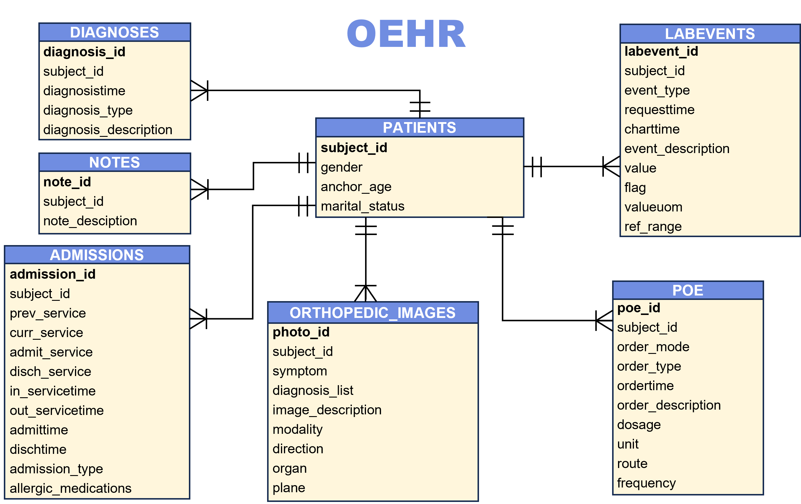

# OEHR

### 1. DataSet

#### 1.1 Description

An Orthopedic Electronic Health Record Dataset., sourced from the EHR of real hospitals. Information available includes patient measurements, diagnoses, treatments, clinical notes, and medical images.  Besides, OEHR is a multilingual dataset, including English and
Chinese. 


#### 1.2 Location

You can download the sample of OEHR in the folder, named sample. The folder's path is "OEHR/sample/".


#### 1.3 Structure




### 2. Automatic OCR-Aided Tool
#### 2.1 Description

Based on PP-Structure, this tool utilizes OpenCV and LSD algorithms for enhancement to process images in the research scenario. The technical details have universal adaptability and are worth referring to.


#### 2.2 Install Environment

We can find the 'requirements.txt'  in 'OEHR/Automatic OCR-Aided Tool/'. Then use the follow command, we can install the environment we need. 

```shell
pip install -r requirements.txt
```


#### 2.3 Sample

We only use the 'Process_Advice.py' to be the sample. The Fig.1 show the unenhanced effect. The Fig.2 show the enhanced effect.

```python
import cv2
import numpy as np

from paddleocr import PPStructure, save_structure_res


# 对图像做直线检测增强
def detect_lines_enhance(img0):
    '''
    Function:
    检测图片中的直线

    param:
    image_path: str -> 图片路径

    return:
    None
    '''

    # 截取图片中的固定区域
    img0 = img0[210:860, 290:1175]

    # 将彩色图片转换为灰度图片
    img = cv2.cvtColor(img0, cv2.COLOR_BGR2GRAY)

    # 创建一个LSD对象
    lsd = cv2.createLineSegmentDetector(0)

    # 执行检测结果
    dlines = lsd.detect(img)

    # 绘制检测结果
    for dline in dlines[0]:
        x0 = int(round(dline[0][0]))
        y0 = int(round(dline[0][1]))
        x1 = int(round(dline[0][2]))
        y1 = int(round(dline[0][3]))
        cv2.line(img0, (x0, y0), (x1, y1), (255, 125, 255), 1, cv2.LINE_AA)
        # cv2.line(img0, (x0, y0), (x1, y1), (0, 255, 0), 1, cv2.LINE_AA)

    return img0


# 示例用法
if __name__ == '__main__':
    # -----------------1.测试检测直线----------------- #
    image_path = 'Input/Advice/advice_8.png'
    save_dir = 'Ouput/Advice_Out'
    image_path_1 = 'advice_8_Unenhance'

    # 读取输入图片
    img0 = cv2.imread(image_path)
    cropped_image = detect_lines_enhance(img0)

    table_engine = PPStructure(layout = False, show_log = True)
    result = table_engine(cropped_image)
    print('result: ', result)

    # save_structure_res(result, save_dir, image_path_1)
    # ---------------------------------------------- #
```


<div align = "center">Fig.1 Unenhanced Effect</div> 


<div align = "center">Fig.2 Enhanced Effect</div> 


### 3. Time Random Drift Algorithm

#### 3.1 Description

The algorithm is implemented using Python and is designed to protect patients' time information. Due to the need to prevent information leakage, there are no examples provided for this algorithm.
